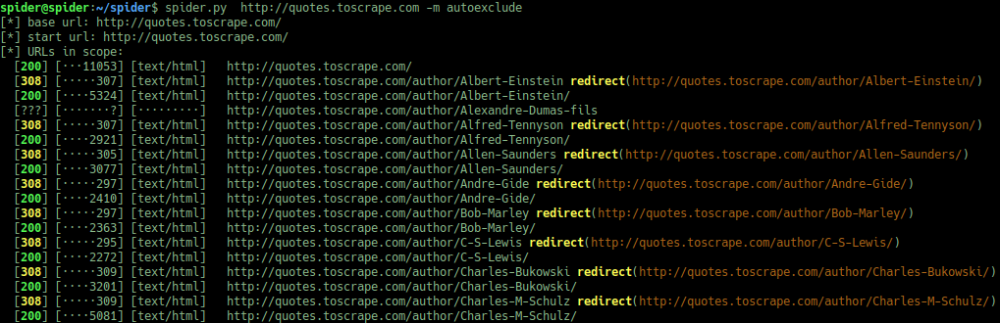

# Simple Spider

This code started as a light weight spider for small
websites. Particularly CTF style challenges. It was partially inspired
by `w3af`'s spider feature (however with less features and easier to
use - at least by me).

I have also added a few features that are more suited to CTF problems
where its necessary to carefully check all info provided in case
something is being hidden (e.g. text file in place of an image file).



## Current features

* Fuzzing file names

    * common page names like `index` (wordlist can be provided)
    * looking for backup files with known extensions

* Checking server reported content type matches downloaded content type (uses `libmagic`).
* Parsing `form` elements and providing summaries of what is posted.
* Looking for `sourceMappingURL` in js files.
* Skips certain directories:

    * If a common  Apache, IIS and NGINX directory index is found
    * Path matches `vendor`, `third-party`, and a few others

* There is also some logic for auto excluding paths if there are hits for random file names.
* Setting the target ip address (useful when hitting different vhosts)

## Usage

Basic usage is as follows:

```plaintext
$ spider.py http://some.domain/service/index.html
```

This will spider only pages under
`http://some.domain/service/`. Instead to spider the whole domain, but
give it an initial path to start program as (while excluding the
assets directory):

```plaintext
$ spider.py http://some.domain/ service/index.html --exclude-path assests
```

Sometimes, the enabled mutators will cause issues with the spidered
website. E.g. lots of false positives or exclude directories that
should be spidered. Use the `-m` option to enable/disable specific
mutators. That is, `relatedfiles` and `commonfiles` are enabled by
default and can easily increase the time to spider.

To help identify when this is happening, run with `-v` flag
to see all the technical details. Alternatively, if the format of a
page to ignore (e.g. a 404 page that does not return 404 status) this
can be used tuned with the `--filter-*` arguments to limit recursion.

There are times when not only printing a summary of the pages found is
useful but also which pages linked to them. Run with
`--show-backlinks` to enable this. However, it can substantially
increase the output, e.g. if there is a `js` file included in each page,
then each of those script tags will be itemised on a separate line.

### Usage info

```plaintext
$ spider.py -h
usage: spider.py [-h] [--exclude-path EXCL_PATH] [--target-ip IP] [--depth NUM] [--header HEADERS] [--verbose] [--log-file LOGFILE] [--hide-external] [--hide-media]
                 [--filter-regex REGEX] [--filter-status [CODE [CODE ...]]] [--filter-all-pages] [--mutators [MUTATORS [MUTATORS ...]]] [--mutator-wordlist MUT:FILE] [--threads NUM]
                 [--show-backlinks]
                 BASE_URL [START_PATH [START_PATH ...]]

Simple Spider.

positional arguments:
  BASE_URL              Base url to start spidering from (limits scope).
  START_PATH            Paths, relative from BASE_URL to start spidering from.

optional arguments:
  -h, --help            show this help message and exit
  --exclude-path EXCL_PATH, -e EXCL_PATH
                        Paths, relative from BASE_URL to prune.
  --target-ip IP, -t IP
                        Redirect connections to given "host:port" combo.
  --depth NUM, -d NUM   Maximum number of links to follow from base url. Default 5.
  --header HEADERS, -H HEADERS
                        "Header: value" pairs to add to requests.
  --verbose, -v         Enable detailed logging, give twice for full debug.
  --log-file LOGFILE    File to log to, default stderr
  --hide-external, -he  Do not list urls outside of base url.
  --hide-media, -hm     Do not list urls with media mime type (detected by libmagic).
  --filter-regex REGEX, -fr REGEX
                        Regex for error pages, if not set, fallback to -fc.
  --filter-status [CODE [CODE ...]], -fc [CODE [CODE ...]]
                        Status to filter (default: 404). no params: >=400 (or with -fr set does nothing).
  --filter-all-pages    Apply filter to all pages (default: only guessed/fuzzed pages).
  --mutators [MUTATORS [MUTATORS ...]], -m [MUTATORS [MUTATORS ...]]
                        Fuzzers to apply, (default: autoexclude, subdirs, relatedfiles, commonfiles). available: autoexclude (add acceptall urls to externals), commonfiles (use wordlist in each directory),
                        relatedfiles (add exts. to files looking for backups), subdirs (enumerate parent directories)
  --mutator-wordlist MUT:FILE, -wl MUT:FILE
                        Wordlist used by mutator: "mutator:filename".
  --threads NUM         Number of threads (default: 10).
  --show-backlinks      For links not guessed, show source page.
```

## Limitations

The output is not saved to disk. It was always the intention to dump a
json object to disk, but it was not implemented.

Does not parse `robots.txt` yet.

The current implementation makes it tricky to chain events on certain
results. E.g. run some additional functionality if a given request
succeeds/fails. While some of the mutators provided (such as detecting
false positives) work like this, it requires *hacking* these features
into the code. Ideally the code needs to be re-implemented considering
this change.

It would be interesting to make use of a tool such as `Puppeteer` so
that pages which make use of JavaScript can be crawled
successfully. Potentially even SPAs. As such, it would make sense that
if this was to be re-implemented then `nodejs` would be preferable to
python.


## Other Bits

Copyright 2021, Karim Kanso. All rights reserved. Project licensed
under GPLv3.
